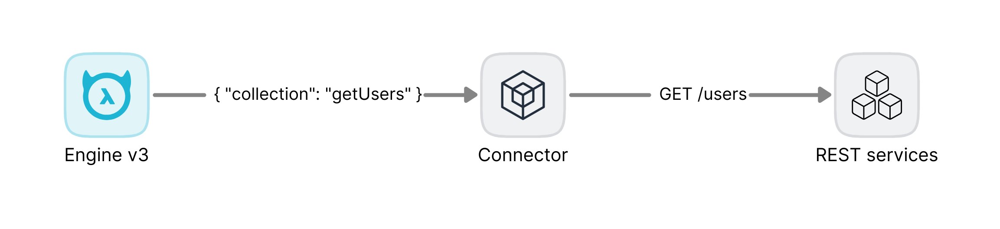

# HTTP Connector

HTTP Connector allows you to quickly convert HTTP APIs to NDC schema and proxy requests from GraphQL Engine v3 to remote services.
The connector can automatically transform OpenAPI 2.0 and 3.0 definitions to NDC schema.

## Features

- [No code. Configuration based](#configuration).
- Composable API collections.
- [Supported many API specifications](./docs/configuration.md#supported-specs).
- [Supported authentication](./docs/authentication.md).
- [Supported headers forwarding](./docs/authentication.md#headers-forwarding).
- [Supported argument presets](./docs/argument_presets.md).
- [Supported timeout and retry](#timeout-and-retry).
- Supported concurrency and [sending distributed requests](./docs/distribution.md) to multiple servers.
- [GraphQL-to-REST proxy](./docs/schemaless_request.md).

**Supported request types**

| Request Type | Query | Path | Body | Headers |
| ------------ | ----- | ---- | ---- | ------- |
| GET          | ✅     | ✅    | NA   | ✅       |
| POST         | ✅     | ✅    | ✅    | ✅       |
| DELETE       | ✅     | ✅    | ✅    | ✅       |
| PUT          | ✅     | ✅    | ✅    | ✅       |
| PATCH        | ✅     | ✅    | ✅    | ✅       |

**Supported content types**

| Content Type                      | Supported |
| --------------------------------- | --------- |
| application/json                  | ✅         |
| application/xml                   | ✅         |
| application/x-www-form-urlencoded | ✅         |
| multipart/form-data               | ✅         |
| application/octet-stream          | ✅ (\*)    |
| text/\*                           | ✅         |
| application/x-ndjson              | ✅         |
| image/\*                          | ✅ (\*)    |

\*: Upload file content types are converted to `base64` encoding.

**Supported authentication**

| Security scheme | Supported | Comment                                                                                                                                   |
| --------------- | --------- | ----------------------------------------------------------------------------------------------------------------------------------------- |
| API Key         | ✅         |                                                                                                                                           |
| Basic Auth      | ✅         |                                                                                                                                           |
| Bearer Auth     | ✅         |                                                                                                                                           |
| Cookies         | ✅         | Require forwarding the `Cookie` header from the Hasura engine.                                                                            |
| OAuth 2.0       | ✅         | Built-in support for the `client_credentials` grant. Other grant types require forwarding access tokens from headers by the Hasura engine |
| mTLS            | ✅         |                                                                                                                                           |

## Get Started

Follow the [Quick Start Guide](https://hasura.io/docs/3.0/getting-started/overview/) in Hasura DDN docs. At the `Connect to data` step, choose the `hasura/http` data connector from the dropdown. The connector template includes an example that is ready to run.

## Documentation

- [Configuration](./docs/configuration.md)
- [Authentication](./docs/authentication.md)
- [Argument Presets](./docs/argument_presets.md)
- [Schemaless Requests](./docs/schemaless_request.md)
- [Distributed Execution](./docs/distribution.md)
- [Recipes](https://github.com/hasura/ndc-http-recipes/tree/main): You can find or request pre-built configuration recipes of popular API services here.
- [NDC HTTP schema](./ndc-http-schema)

## Frequently Asked Questions

### Why does this connector exist? Compared with the OpenAPI connector?

HTTP connector is a configuration-based HTTP engine and isn't limited to the OpenAPI specs only. You can use this connector as a GraphQL-to-HTTP proxy service without any OpenAPI documentation required. The connector also built-in support for retry, advanced authentication schemes such as mTLS, and response transformer. 

Meanwhile, the [OpenAPI Connector](https://hasura.io/docs/3.0/connectors/external-apis/open-api) generates OpenAPI APIs to TypeScript code. If you want to take more control of OpenAPI or use it as a library, the OpenAPI connector is suitable for your requirements.

### What if our API servers don't support OpenAPI docs?

Most of web frameworks support plugins or middlewares for OpenAPI generation these days. We recommend you integrate them so you don't need to manually update the docs for future API changes.

Otherwise, if you are using [Postman](https://www.postman.com/) to manage your API documentation, many tools, such as [postman2openapi] (https://kevinswiber.github.io/postman2openapi/), will help you convert Postman collections to OpenAPI documents.

## License

HTTP Connector is available under the [Apache License 2.0](./LICENSE).
